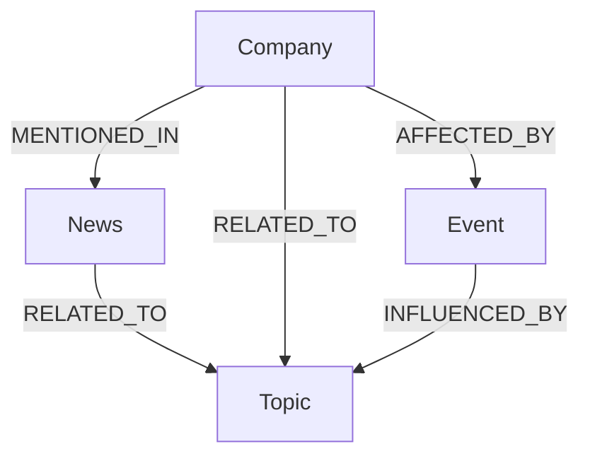

# FinBridge GraphRAG 지식그래프 온톨로지(Ontology) 정의서

본 문서는 FinBridge GraphRAG 서비스의 Neo4j 지식그래프 스키마(노드 및 엣지)를 정의합니다. 본 온톨로지는 정형 데이터(PostgreSQL) 및 RAG 텍스트(pgvector)와 유기적으로 결합하여, 금융 복합 질의(GraphRAG)에 대한 맥락 데이터를 제공합니다.

---

## 1. 노드(Node) 정의

### 1.1. Company (기업)
금융 분석의 기본 단위가 되는 상장 기업 노드입니다.
* **레이블**: `:Company`
* **속성**:
  * `symbol` (String, UNIQUE): 종목 코드 (예: `"005930"`, `"TSLA"`)
  * `name` (String): 기업명 (예: `"삼성전자"`, `"Tesla"`)
  * `market` (String): 소속 시장 (예: `"KOSPI"`, `"NASDAQ"`)
  * `industry` (String): 산업군 (예: `"반도체"`, `"자동차제조업"`)
  * `created_at` (Datetime): 노드 생성 일시

### 1.2. News (뉴스)
정부 정책, 거시경제, 기업 동향을 담은 뉴스 메타데이터 노드입니다.
* **레이블**: `:News`
* **속성**:
  * `id` (Integer, UNIQUE): 뉴스 고유 ID (PostgreSQL `news` 테이블의 `id`와 1:1 매핑)
  * `title` (String): 뉴스 제목 (예: `"삼성전자 2분기 영업이익 10조 돌파 전망"`)
  * `source` (String): 뉴스 출처 (예: `"한국경제"`, `"Reuters"`)
  * `url` (String): 뉴스 본문 링크
  * `published_at` (Datetime): 뉴스 발행 일시
  * `sentiment_score` (Float): 감성 분석 점수 (PostgreSQL `sentiments` 테이블 참고, `-1.0` ~ `1.0`)
  * `sentiment_label` (String): 감성 결과 분류 (예: `"positive"`, `"neutral"`, `"negative"`)

### 1.3. Event (이벤트)
금융 시장 및 개별 기업에 중대한 영향을 준 주요 경제적/기업적 사건 노드입니다.
* **레이블**: `:Event`
* **속성**:
  * `id` (Integer, UNIQUE): 이벤트 고유 ID (PostgreSQL `events` 테이블의 `id`와 1:1 매핑)
  * `event_type` (String): 이벤트 분류 (예: `"금리변동"`, `"실적발표"`, `"인수합병"`, `"규제발표"`)
  * `description` (String): 이벤트 상세 설명
  * `event_date` (Date): 이벤트 발생일

### 1.4. Topic (주제/테마)
기업 및 뉴스를 관통하는 고차원 금융 테마, 산업 분야, 거시경제 키워드 노드입니다.
* **레이블**: `:Topic`
* **속성**:
  * `name` (String, UNIQUE): 주제 이름 (예: `"반도체"`, `"인공지능"`, `"인플레이션"`, `"기준금리"`)

---

## 2. 관계(Edge) 정의

### 2.1. `[:MENTIONED_IN]` (Company ➔ News)
* **정의**: 특정 기업이 뉴스 본문 또는 제목에 중요하게 언급되었음을 나타냅니다.
* **방향**: `(:Company)-[:MENTIONED_IN]->(:News)`
* **속성**:
  * `relevance_score` (Float): 뉴스 내 해당 기업의 중요도/연관성 점수 (`0.0` ~ `1.0`)

### 2.2. `[:RELATED_TO]` (News ➔ Topic)
* **정의**: 뉴스가 다루고 있는 거시경제 현상, 산업 주제 또는 트렌드와 연관되어 있음을 나타냅니다.
* **방향**: `(:News)-[:RELATED_TO]->(:Topic)`
* **속성**: None

### 2.3. `[:RELATED_TO]` (Company ➔ Topic)
* **정의**: 기업의 주력 사업 분야 또는 테마군을 나타냅니다.
* **방향**: `(:Company)-[:RELATED_TO]->(:Topic)`
* **속성**:
  * `weight` (Float): 연관 강도 (예: 매출 비중 등, 기본값 `1.0`)

### 2.4. `[:AFFECTED_BY]` (Company ➔ Event)
* **정의**: 특정 이벤트(예: 실적 쇼크, 규제 통과 등)가 개별 기업의 주가나 기업 가치에 영향을 미쳤음을 나타냅니다.
* **방향**: `(:Company)-[:AFFECTED_BY]->(:Event)`
* **속성**:
  * `impact_label` (String): 영향 방향 (예: `"positive"`, `"negative"`, `"neutral"`)

### 2.5. `[:INFLUENCED_BY]` (Event ➔ Topic)
* **정의**: 특정 시장 이벤트가 거시경제 주제(예: 금리 인상, 원자재 가격 상승 등)의 영향을 받아 발생했음을 나타냅니다.
* **방향**: `(:Event)-[:INFLUENCED_BY]->(:Topic)`
* **속성**: None

---

## 3. 제약 조건 및 인덱스 (Constraints & Indexes)

효율적인 Graph Traversal 및 데이터 무결성을 위해 Neo4j에 다음과 같은 인덱스와 고유 제약 조건을 설정합니다.

1. **Company 고유 제약**: `CREATE CONSTRAINT FOR (c:Company) REQUIRE c.symbol IS UNIQUE`
2. **News 고유 제약**: `CREATE CONSTRAINT FOR (n:News) REQUIRE n.id IS UNIQUE`
3. **Event 고유 제약**: `CREATE CONSTRAINT FOR (e:Event) REQUIRE e.id IS UNIQUE`
4. **Topic 고유 제약**: `CREATE CONSTRAINT FOR (t:Topic) REQUIRE t.name IS UNIQUE`
5. **인덱스 생성**:
   * `CREATE INDEX FOR (c:Company) ON (c.name)`
   * `CREATE INDEX FOR (n:News) ON (n.published_at)`
   * `CREATE INDEX FOR (e:Event) ON (e.event_date)`
